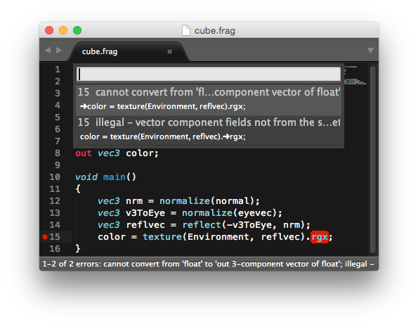

glslAdditions
=============

Various useful stuff for working with GLSL shaders.

## GLSL-filter for doxygen ##

A filter for [doxygen](http://www.doxygen.org/) to process GLSL shader, usage explained [here](http://www.numb3r23.net/2012/02/15/doxygen-and-glsl-shader/). An example can be seen [here](http://www.grasmo.de/download/glslfilter/glslfilter_example.html). You can also run `doxygen` in the doxygen/doxytest subfolder to generate the documentation for a minimal example.

#### tl;dr ####
Integrate the doxygen filter into your project:
- Add `FILE_PATTERNS: *.frag, *.vert`
- Add `FILTER_PATTERNS: "*.frag=./glslfilter.py", "*.vert=./glslfilter.py"`
- Add `EXTENSION_MAPPING=.frag=C++, .vert=C++`

## LaTeX Syntax-highlight with listings ##

If you want some colored source code in your LaTeX document feel free to use the syntax-definitions.

## SublimeLinter glslangValidator ##

I've written a [linter plugin](https://github.com/numb3r23/SublimeLinter-contrib-glsl) for [Sublime Text](http://www.sublimetext.com/) plugin [SublimeLinter](http://sublimelinter.readthedocs.org/en/latest/) that uses Kronos Reference-Compiler [glslangValidator](https://www.khronos.org/opengles/sdk/tools/Reference-Compiler/) to compile GLSL code. The errors (if any) are highlighted in the editor as shown below:

## Other things ##

There's a bash script [blurCubemap.sh](blurCubemap.sh) to blur a cubemap, e.g. useful for diffuse reflections and IBL things. Feel free to change the blur values for a more blurred variant. The input is expected to have the name convention: `[neg,pos][x,y,z].jpg`.
